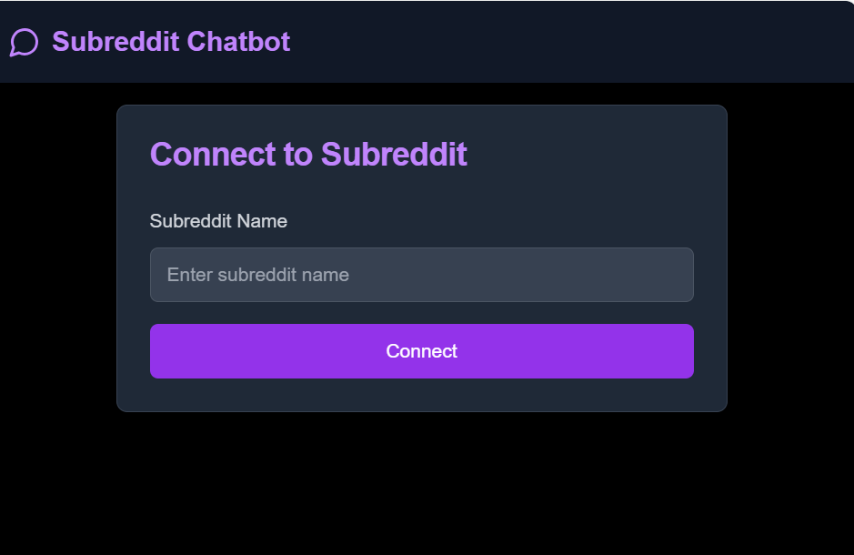
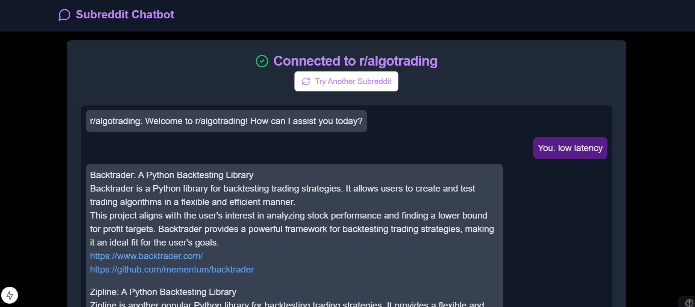

# Subreddit Chatbot

## Project Overview

The Subreddit Chatbot is designed to help users discover project ideas from specific subreddits. It leverages the power of large language models to analyze subreddit content and provide tailored project recommendations.

### Key Features and Benefits
- **Project Idea Discovery**: Extracts and recommends project ideas from subreddit discussions.
- **Interactive Chat Interface**: Users can interact with the bot to refine their project search.
- **Customizable**: Users can connect to any subreddit of their choice.

### Target Users/Use Cases
- **Developers**: Looking for new project ideas or inspiration.
- **Researchers**: Analyzing trends and discussions in specific subreddits.
- **Hobbyists**: Exploring new topics and projects in their areas of interest.

### Screenshots/Demos
- 
- 

## Technical Details

### Technologies Used
- **Backend**: Python, Flask, PRAW (Python Reddit API Wrapper)
- **Frontend**: React, TypeScript
- **Machine Learning**: Together AI Embeddings, Langchain
- **Database**: ChromaDB

### System Requirements
- Python 3.8+
- Node.js 14+

### Architecture Overview
- **Backend**: Handles subreddit data retrieval and processing.
- **Frontend**: Provides a user interface for interaction.
- **ChromaDB**: Stores and retrieves embeddings for project recommendations.

### External Dependencies
- Reddit API
- Together AI API
- ChromaDB

### Environment Variables
- `REDDIT_CLIENT_ID`
- `REDDIT_CLIENT_SECRET`
- `REDDIT_USER_AGENT`
- `TOGETHER_API_KEY`

## Getting Started

### Prerequisites
- Python and Node.js installed
- Access to Reddit API credentials

### Installation Steps
1. Clone the repository.
2. Install backend dependencies: `pip install -r requirements.txt`
3. Install frontend dependencies: `npm install`
4. Set up environment variables in a `.env` file.

### Configuration
- Configure API keys and subreddit preferences in the `.env` file.

### Quick Start Example
- Run the backend server: `python app.py`
- Start the frontend: `npm run dev`

### Common Setup Issues and Solutions
- Ensure all environment variables are correctly set.
- Check API key validity and permissions.

## Usage Guide

### Basic Usage Examples
- Connect to a subreddit and start receiving project recommendations.

### API Documentation
- **POST /connect**: Connects to a subreddit.
- **POST /chat**: Sends a message to the chatbot.

### Configuration Options
- Customize subreddit and API settings in the frontend.

### Best Practices
- Regularly update API keys and dependencies.

### Common Use Cases
- Discovering new project ideas.
- Analyzing subreddit discussions.

### Contact/Support
- For support, contact [tyagi4ashish@gmail.com](mailto:tyagi4ashish@gmail.com).
